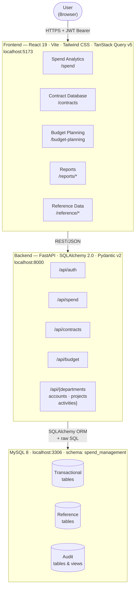
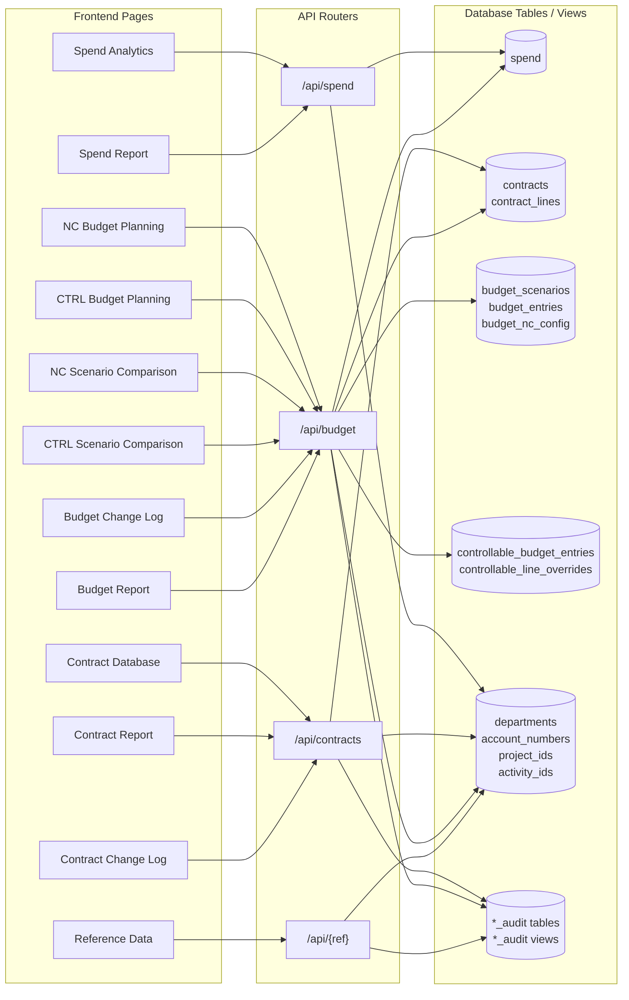
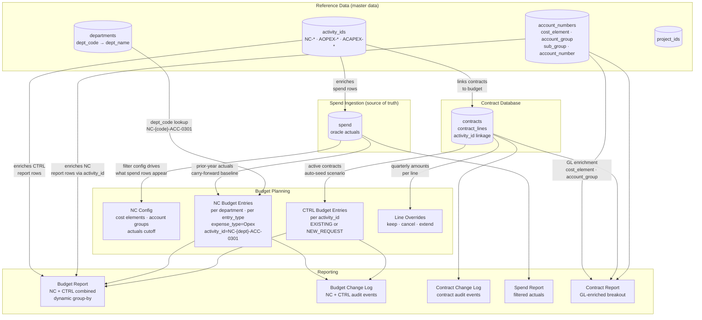
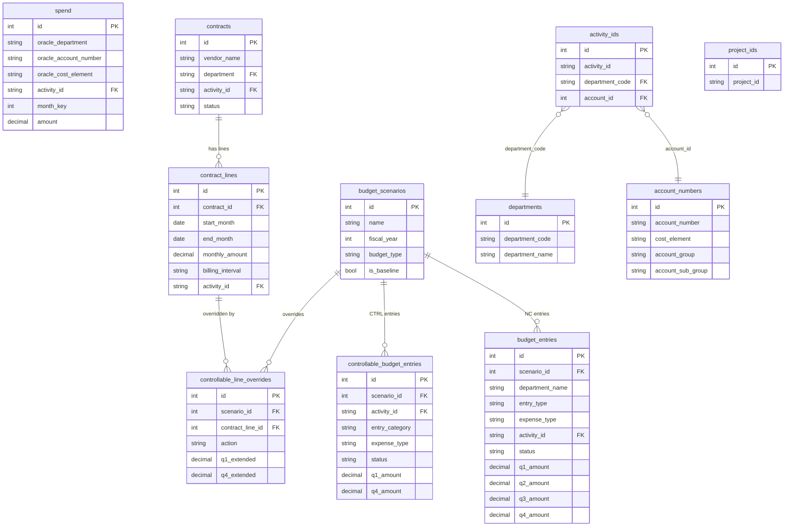
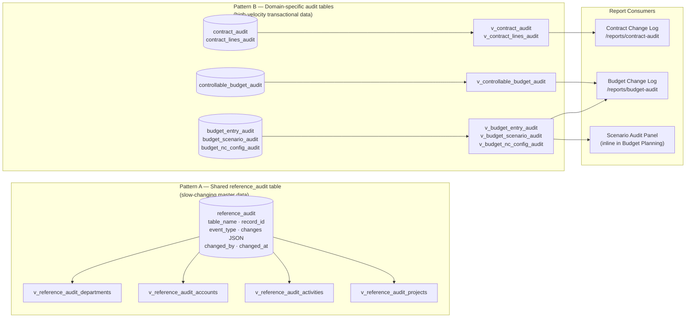
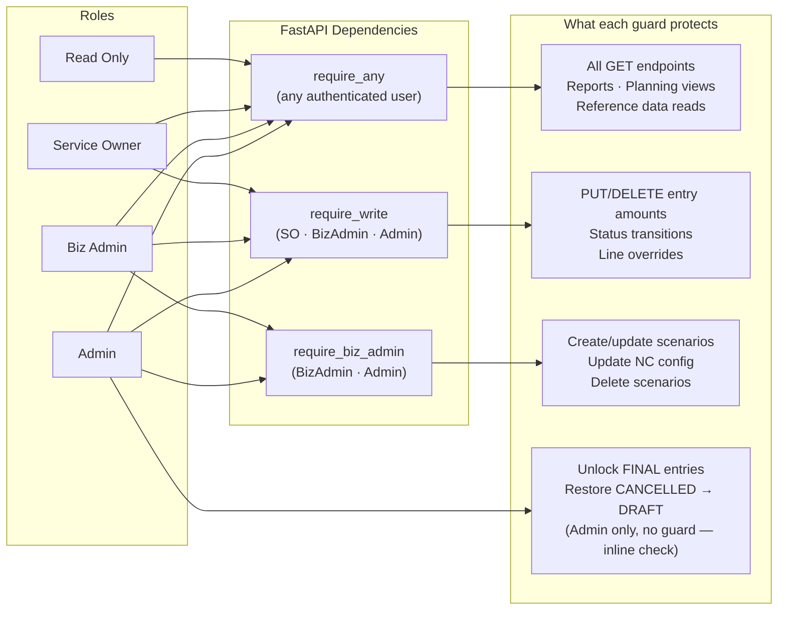
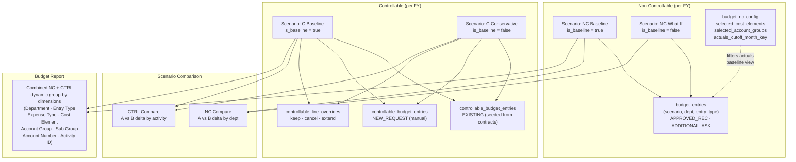
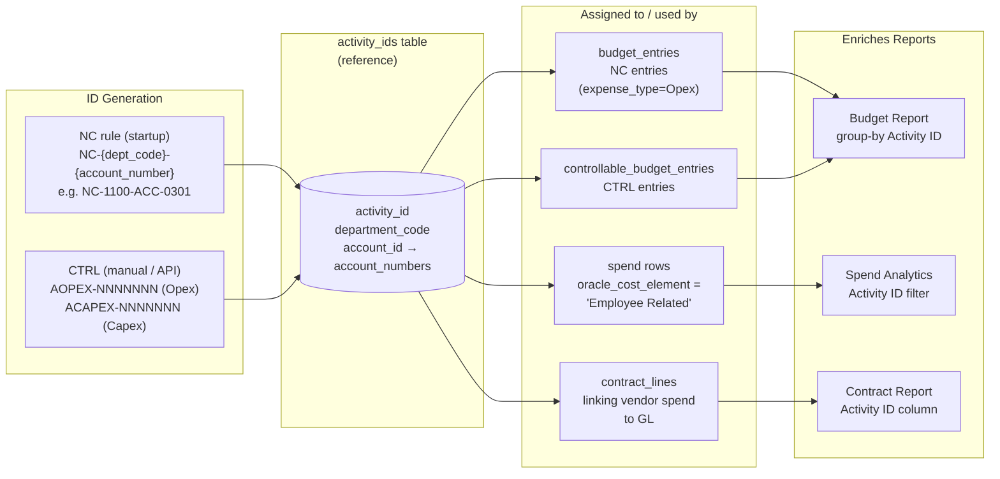

# Functional Architecture

**Spend Management Platform — as-built**

---

## 1. System Overview

Three-tier web application: React frontend, FastAPI backend, MySQL database. Auth is JWT-based with four roles (Admin, BizAdmin, ServiceOwner, ReadOnly).

---

## 2. Module Map

Each frontend module, the API domain it calls, and the database tables it reads or writes.

---

## 3. Cross-Module Data Flows

The platform's key insight is that **reference data and spend history flow into planning and reporting**. The arrows below show where data from one domain is consumed by another.

---

## 4. Database Domain Map

Tables and views organized by domain, with primary relationships shown.

---

## 5. Audit Architecture

Two audit patterns are used depending on data velocity.

---

## 6. Role-Based Access Control

---

## 7. Budget Planning Scenario Model

---

## 8. Activity ID Lineage

Activity IDs are the join key that links spend history, contracts, and budget planning into a unified view.

---

## 9. Implemented Features Summary

| Module | Status | Pages | API Domain | Key Tables |
|---|---|---|---|---|
| Spend Analytics | ✅ Done | `/spend` | `/api/spend` | `spend` |
| Contract Database | ✅ Done | `/contracts` | `/api/contracts` | `contracts`, `contract_lines` |
| Contract Report | ✅ Done | `/reports/contracts` | `/api/contracts` | `v_contracts_enriched` |
| Contract Change Log | ✅ Done | `/reports/contract-audit` | `/api/contracts` | `v_contract_audit`, `v_contract_lines_audit` |
| NC Budget Planning | ✅ Done | `/budget-planning` (NC tab) | `/api/budget` | `budget_scenarios`, `budget_entries`, `budget_nc_config` |
| NC Scenario Comparison | ✅ Done | `/budget-planning` (NC Compare tab) | `/api/budget` | `budget_scenarios`, `budget_entries` |
| CTRL Budget Planning | ✅ Done | `/budget-planning` (CTRL tab) | `/api/budget` | `controllable_budget_entries`, `controllable_line_overrides` |
| CTRL Scenario Comparison | ✅ Done | `/budget-planning` (CTRL Compare tab) | `/api/budget` | `controllable_budget_entries` |
| Budget Report | ✅ Done | `/reports/budget` | `/api/budget` | `budget_entries`, `controllable_budget_entries`, `activity_ids`, `account_numbers` |
| Budget Change Log | ✅ Done | `/reports/budget-audit` | `/api/budget` | `v_budget_entry_audit`, `v_controllable_budget_audit` |
| Spend Report | ✅ Done | `/reports/spend` | `/api/spend` | `spend`, `account_numbers` |
| Reference Data | ✅ Done | `/reference/*` | `/api/{domains}` | `departments`, `account_numbers`, `project_ids`, `activity_ids` |
| Forecasting | 🔜 Planned | `/forecasting` | — | — |
| Forecast Report | 🔜 Planned | `/reports/forecast` | — | — |
| Budget Report (tabular) | 🔜 Planned | `/reports/budget` | — | — |
